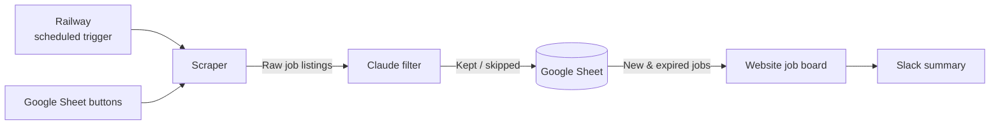
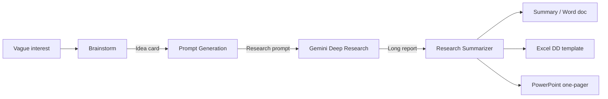
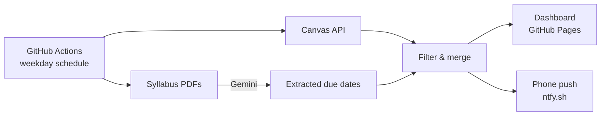

# Hello, I'm Aiden Fisher

I enjoy building projects that challenge my technical skillset and solve problems that I see around me. I fully believe in the power of AI, and I am passionate about using it to both increase productivity and to enable new capabilities in both business and software development that would have been impossible a few years back. AI is the most powerful tool for a developer today, but I believe it's full potential is unlocked by having a complete technical skillset with deep understanding of Computer Science and LLM algorithms. 

---

## Professional Projects 

### 💼 Portfolio Company Job Board (Atlanta Ventures)

**Why I built it:** Atlanta Ventures' previous website listed open jobs at its portfolio companies in static HTML. That worked for a while, but jobs close, and updating the website by hand every time was a hassle, so many expired job links stayed up. For the launch of the new Atlanta Ventures website, I built a process that keeps the job board current on its own: finding new openings, adding them to the site, and removing them once they close.

**What it does:** Automatically finds open jobs on Atlanta Ventures' portfolio companies' career pages, filters out irrelevant ones, and keeps the job board on atlantaventures.com up to date, adding new jobs and removing filled ones without anyone touching the website. Adding a new portfolio company is just a new row in a Google Sheet with a link to its careers page.

**How it works:**



1. **Trigger:** A scheduled task on Railway runs weekly. The team can also start a run manually from a button in the Google Sheet.
2. **Scrape:** For each company in the Sheet, it pulls jobs from their careers page. It supports the major hiring platforms (Greenhouse, Lever, Ashby, and others), plus Google Docs, PDFs, and regular web pages.
3. **Filter:** Claude reviews each job, decides whether it belongs on the board, and categorizes it.
4. **Store:** Jobs are saved to a Google Sheet, which acts as the database. Rejected jobs go to a separate tab so the team can review them.
5. **Sync:** New jobs are posted to the website, and jobs no longer listed are removed.
6. **Report:** A summary of each run, including any errors, is posted to Slack.

<details>
<summary><b>Architecture details</b></summary>

<br>

1. **The pieces and what each one does:**
   - **Google Sheet:** the database (Companies, Jobs, and Skipped tabs) and the control panel
   - **Apps Script:** adds a menu to the Sheet so non-technical staff can approve, add, or
     remove jobs, or start a run, without touching code
   - **Google Cloud service account:** a bot account is attached to the google sheet that lets the Python code read and write
     the Sheet
   - **Railway:** hosts the webhooks that the Sheet's manual run buttons call, and runs the weekly scrape.
   - **Python:** the scrapers, filtering, syncing, and alerts
   - **Claude API:** filters and categorizes jobs, and reads jobs from pages that don't use
     a standard hiring platform
   - **WordPress API:** posts and removes jobs on the live website
   - **Slack:** run summaries and alerts

2. **Built to fail safely.** If a scraper breaks, the system stops finding new jobs but never
   deletes real ones. It can tell "this company has no open jobs" apart from "the scraper
   broke," and only removes jobs in the first case.

3. **Clear alerts.** It detects when an entire hiring platform breaks at once (usually a sign
   the platform changed its API) and sends a distinct Slack alert for each type of failure,
   so the fix is obvious.

4. **Designed to be handed off.** Before leaving, I transferred every account to a
   non-technical owner and wrote a handoff guide. A Claude bot in Slack fixes low-risk issues
   on its own and refuses to fix anything risky (ex: core logic that pushes jobs to the website).

</details>

**How AI was used:** For everything. All of the code was written with AI, and Claude is also the brain of the system, deciding which jobs belong on the board and reading jobs from pages that don't follow a standard format. I owned the system design and architecture.

**Tech:** Python, Claude API, Google Sheets + Apps Script, Google Cloud, Railway, WordPress
API, Slack

---

### 📊 Portfolio Metrics (Atlanta Ventures)
`Google Apps Script` · `Claude API` · `Google Sheets` · Repo private

**Why I built it:** Founder updates were spread across inboxes, and the data in them was hard to see over time. I built this to centralize those updates and turn their numbers into charts. I set up a dedicated email account that's included on every founder update, connected it to a Google Sheet, and had it update itself weekly.

**What it does:** Reads founder update emails, pulls out key metrics (like revenue, customers,
and churn), and turns them into charts for each portfolio company in a Google Sheet.

**How it works:**

```
Founder emails → Relevance check → Metric extraction → Google Sheet → Charts per company
```

1. **Collect:** Every Monday, it checks the dedicated inbox for new update emails from each portfolio company.
2. **Filter:** Claude checks whether each email actually contains metrics.
3. **Extract:** Claude pulls out the numbers that company tracks, and each row links back to
   the email it came from.
4. **Display:** Each company gets its own tab with a chart for every metric and a date filter.

The team manages everything from a menu in the Sheet: run a sync, add a new company (Claude suggests which metrics to track from its past emails), or add and remove metrics. No code outside of AppScript.

---

### 🔬 Claude Research Process for Atlanta Ventures

**Why I built it:** I was tasked with finding parts of the Atlanta Ventures team's work that could be improved with AI. The team had many ideas, and these of these ideas pointed to the same concept: research. I combined many of their ideas into a singular process that people people who weren't experienced with AI could use at any stage of their ideas, whether they had a vague interest, a specific idea they wanted to explore, or a finished research report that they wanted to make sense of.

**How it works:**



1. **Brainstorm** helps the user turn a vague interest into a specific, well-defined idea worth researching.
2. **Prompt Generation** writes a detailed research prompt for that idea,
   company, market, or person, so the user doesn't need to know how to write one.
3. **Gemini Deep Research** the user pastes the prompt into Gemini, which searches the web
   and returns a long, detailed report.
4. **Research Summarizer** turns that report into a short summary of what
   matters, with sources. It can also create a Word doc, an Excel due-diligence template,
   or a PowerPoint one-pager.

<details>
<summary><b>Architecture details</b></summary>

<br>

1. **Built on Claude.** The pipeline runs as three Claude skills inside Claude Cowork. Skills are
   packaged as `.skill` files and installed on each team member's laptop, so everyone runs the
   same version. It requires:
   - A Claude subscription with Cowork access
   - **Connectors:** web search (to verify companies and fill in missing details) and Google
     Drive (to save finished files where the team can find them)
   - A Gemini account for the Deep Research step, which the user runs manually

2. **Each skill figures out what the user needs.** Before doing anything, each skill
   detects where the user is and follows only the instructions for that case.
   - *Brainstorm:* no direction, one theme, many themes, or a specific idea
   - *Prompt Generation:* researching an opportunity, company, industry, or person, and whether
     it's for an investment decision or general exploration
   - *Research Summarizer:* a general summary, an investment due-diligence review, or a one-pager

3. **The skills work together.** Each skill's output is shaped to be the next
   skill's input, so nothing gets lost between steps. For example, Prompt Generation asks Gemini
   for exactly the details the Summarizer needs to fill its tables.

4. **Custom templates with guaranteed formatting.** I built new templates for the team's most
   common use cases, and Python scripts fill them in so every file comes out the same way.
   - **Due diligence workbook (Excel)** takes an investment research report and
     fills a standardized due-diligence review, covering the company, team, market, competitors,
     and risks.
   - **One-pager (PowerPoint)** a single slide that summarizes an idea or company, which can be
     generated from the Summarizer or straight from Brainstorm.
   - **Market brief (Excel)** a quick snapshot of a market, created during Brainstorm.

5. **Built-in guardrails.** The Summarizer must trace every claim back to the research, and
   checks names with web search instead of guessing.

</details>

**How I used AI in development:** I was responsible for gathering the teams needs and designing the process, as well as organizing demos and meetings to get feedback on my (many) prototypes. Claude Co-Work was my primary tool in this process, behaving like a tutor and a developer. It helped me work through and validate my ideas, performed edits on the skill files, and wrote the Python scripts based on my direction. I completely owned the system design and architecture.

**Tech:** Claude skills, Python, Gemini Deep Research

---

## Passion Projects

### 📚 Canvas Digest (In progress)
`Python` · `GitHub Actions` · `GitHub Pages` · `Gemini API` · [Repo](https://github.com/aidenfisherb/School-Assignments)

**Why I built it:** Canvas is used at many college, and it buries what's actually due among things that don't need action, and some due dates only exist in the syllabus. I wanted to centralize my work in one place.

**What it does:** Every weekday morning, it pulls my assignments from Canvas, drops anything already submitted or marked done, and sends me a phone notification with a link to a simple dashboard. It also reads my syllabi to catch due dates Canvas is missing.

**How it works:**



1. **Collect:** Pulls assignments and submission status from my favorited Canvas courses.
2. **Read syllabi:** Gemini extracts graded deadlines from uploaded syllabus files.
3. **Filter & merge:** Drops finished work, combines Canvas and syllabus items, and sorts them
   into Overdue, Due Today, and Coming Up.
4. **Deliver:** Publishes the dashboard and sends a short push notification.

<details>
<summary><b>Architecture details</b></summary>

<br>

1. **Canvas is the source of truth.** Syllabus items fill gaps but never silently override Canvas. If the two list different dates for the same assignment, both are shown and flagged "Conflicting."

2. **Extract once, cache forever.** Each syllabus is sent to Gemini only once, and the result is saved next to the file. Replacing the file triggers a new extraction, and I can fix any wrong dates by editing the saved file.

3. **Replaced a regex parser with AI.** My first version used pattern matching, which turned a 13-page syllabus into 40 mostly junk items. Gemini reads the PDF directly and returned 9 items with every date correct.

4. **Reliable on free models.** Request timeouts, retries, and a fallback chain of free Gemini models keep it running when a model is slow or overloaded.

5. **Tested and private.** 45 tests run on every push without any network calls, and all keys live in GitHub's encrypted secrets, never in the code or on the public page.

</details>

**How AI was used:** For the whole thing. All of the code was written with AI, and the app
uses a Gemini API key to extract due dates from each syllabus once.

**Still to do:** Suggesting a plan for when to work on each assignment, handling data stored in obscure places (non assignment-tab), eventually make it easily usable by other students who don't have GitHub.

### 🥏 AidDisc (In progress)
`Python` · `NiceGUI` · `Leaflet` · [Repo](https://github.com/aidenfisherb/AidDisc)

**What it is:** A disc golf app for tracking rounds and measuring throws.
- **Throw distance:** Uses the phone's GPS to measure how far you threw. Because phone GPS
  is noisy, it takes several location readings over 5 seconds, discards the least accurate,
  and averages the rest before calculating distance.
- **Scorecard:** Tracks your score hole by hole and blocks impossible scores.
- **Course catalog:** Browse courses and start a round. <Currently uses sample data.>

**How AI was used:** None in the code. A friend and I are building this project by hand to strengthen our computer science fundamentals and have true ownership over everything we write. AI is being used as a search engine, while we maintain ownership over the design choices and features. 

**What's next:** Saving rounds and courses to a database, finishing course creation, user profiles, polishing UI, publishing app.

---

### ⛪ Church Buddy (2026 Gloo Hackathon)
`TypeScript` · `React` · `Leaflet` · `PostgreSQL` · Repo private

**What it is:** A team app that helps college students find a church in a new town. Users enter
a location and what they're looking for, and get ranked matches on a map, with a source link
for every detail.

<details>
<summary><b>Architecture details</b></summary>

<br>

**How it works:** Church data is collected ahead of time in the background, so searches are
fast database lookups.

```
Discover → Fetch → Extract → Match & Rank → Serve → Map + cards
```

1. **Discover:** Finds churches near a town using OpenStreetMap, Google Places, and church
   directories, then removes duplicates.
2. **Fetch:** Downloads each church's website, following each site's crawling rules.
3. **Extract:** An LLM pulls out details like denomination, service times, and college
   ministries. Each detail gets a confidence score and a link to its source.
4. **Match & Rank:** Scores each church against what the user is looking for.
5. **Serve:** An API returns results to the web app, which shows them on a map and as cards.

</details>

**My role:** On the ingestion team, I built the "polite" part of the Fetch stage. Our crawler
checks each site's robots.txt rules, identifies itself clearly, sends one request at a time with
a pause between them, and skips sites that ask for unreasonable delays.

**How AI was used:** Heavily. All of the code was written with AI, which let our team
move fast during the hackathon, try more ideas, and test every part of the app. Our role became
deciding what to build, prompting Claude Code or Codex, and then reviewing what it produced.

---

## Skills 

Skills are reusable instruction patterns that teach a Claude instance how to complete a specific task well. I believe skills are an easy way to unlock AI's true power for all backgrounds - giving developers the ability to connect AI to real software and data, and non-technical people an easy way to hand off repetitive tasks. 

### 📝 Meeting Analyzer

**Why I built it:** I wanted meeting summaries without paying for a dedicated note-taking tool,
so I built my own in Claude Cowork. I record the meeting with Wispr Flow (a voice-to-text app),
paste the transcript into Claude, and this skill does the rest.

**What it does:** Turns a raw, messy transcript into two short sections:
- **Talking Points:** the 2–4 main topics the meeting covered
- **Action Steps:** concrete next steps, each starting with a verb ("Draft…", "Meet with…",
  "Decide…"), including ones implied but not stated.

---

### 🎓 Teaching

**Why I built it:** Textbooks and generic AI explanations often didn't click for me. I wanted
a tutor that explains things the way I actually learn, and keeps getting better at it.

**What it does:** A personal tutor for homework and studying, with three modes I switch between
in plain words:
- **Learn:** a full explanation, starting with the big-picture answer, defining every term and
  acronym, and explaining why each wrong answer is wrong
- **Method:** teaches me how to solve a problem using metaphors, something I have noted as being useful in teaching myself new things
- **Speed:** just the answers, for when I'm short on time

**Gets smarter over time:** While it teaches, it quietly notes what works and what doesn't
(an explanation that lands, a correction I make) and saves it to a learning profile. Each
session starts from that profile, so explanations get more tailored the more I use it. 

---

### ✉️ Email Writer (In progress)

**Why I'm building it:** AI-written emails often sound generic and nothing like me. I want a
skill that drafts emails in my own voice, and is able to switch tone based on who I am emailing. I email my professors differently than I do my classmates.

**The plan:** Build the skill from real emails I've written, so it learns my tone, structure,
and phrasing instead of writing from a generic template. Troubleshoot until I feel confident in it.
