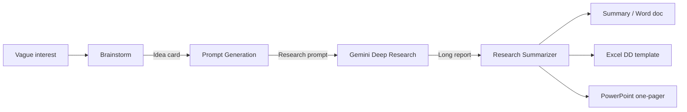

# Hello, I'm Aiden Fisher

I enjoy building projects that challenge my technical skillset and solve problems that I see around me. I fully believe in the power of AI, and I am passionate about using it to both increase productivity and to enable new capabilities in both business and software development that would have been impossible a few years back. AI is the most powerful tool for a developer today, but I believe it's full potential is unlocked by having a complete technical skillset with deep understanding of Computer Science and LLM algorithms. 

## Professional Projects 

# Job Board for Atlanta Ventures

# Email Metrics Tracker for Atlanta Ventures

## Passion Projects

# Canvas Digest

# AidDisc

### 🥏 AidDisc (In progress)
`Python` · `NiceGUI` · `Leaflet` · [Repo](https://github.com/aidenfisherb/AidDisc)

**What it is:** A disc golf app for tracking rounds and measuring throws.
- **Throw distance:** Uses the phone's GPS to measure how far you threw. Because phone GPS
  is noisy, it takes several location readings over 5 seconds, discards the least accurate,
  and averages the rest before calculating distance.
- **Scorecard:** Tracks your score hole by hole and blocks impossible scores.
- **Course catalog:** Browse courses and start a round. <Currently uses sample data.>

**How AI was used:** None in the code. A friend and I are building this project by hand to strengthen our computer science fundamentals and have true ownership over everything we write. AI is being used as a search engine, while we maintain ownership over the design choices and features. 

**What's next** Saving rounds and courses to a database, finishing course creation, user profiles, polishing UI, publishing app.

# GLOO Hackathon 2026

## Skills 
Skills are reusable instruction patterns that teach a Claude instance how to complete a specific task well. I believe skills are an easy way to unlock AI's true power for all backgrounds - giving developers the ability to connect AI to real software and data, and non-technical people an easy way to hand off repetitive tasks. 

# Claude Research Process for Atlanta Ventures
Why I built it: I was tasked with finding parts of the Atlanta Ventures team's work that could be improved with AI. The team had many ideas, and these of these ideas pointed to the same concept: research. I combined many of their ideas into a singular process that people people who weren't experienced with AI could use at any stage of their ideas, whether they had a vague interest, a specific idea they wanted to explore, or a finished research report that they wanted to make sense of.

**How it works:**

1. **Brainstorm** helps the user turn a vague interest into a specific, well-defined idea worth researching.
2. **Prompt Generation** writes a detailed research prompt for that idea,
   company, market, or person, so the user doesn't need to know how to write one.
3. **Gemini Deep Research** the user pastes the prompt into Gemini, which searches the web
   and returns a long, detailed report.
4. **Research Summarizer** turns that report into a short summary of what
   matters, with sources. It can also create a Word doc, an Excel due-diligence template,
   or a PowerPoint one-pager.

   

<b>Architecture details</b>

 

1. **Built on Claude** The pipeline runs as three Claude skills inside Claude Cowork. Skills are
   packaged as `.skill` files and installed on each team member's laptop, so everyone runs the
   same version. It requires:
   - A Claude subscription with Cowork access
   - **Connectors:** web search (to verify companies and fill in missing details) and Google
     Drive (to save finished files where the team can find them)
   - A Gemini account for the Deep Research step, which the user runs manually

2. **Each skill figures out what the user needs** Before doing anything, each skill
   detects where the user is and follows only the instructions for that case.
   - *Brainstorm:* no direction, one theme, many themes, or a specific idea
   - *Prompt Generation:* researching an opportunity, company, industry, or person, and whether
     it's for an investment decision or general exploration
   - *Research Summarizer:* a general summary, an investment due-diligence review, or a one-pager

3. **The skills work together** Each skill's output is shaped to be the next
   skill's input, so nothing gets lost between steps. For example, Prompt Generation asks Gemini
   for exactly the details the Summarizer needs to fill its tables.

4. **Custom templates with guaranteed formatting.** I built new templates for the team's most
   common use cases, and Python scripts fill them in so every file comes out the same way.
   - **Due diligence workbook (Excel)** takes an investment research report and
     fills a standardized due-diligence review, covering the company, team, market, competitors,
     and risks.
   - **One-pager (PowerPoint)** a single slide that summarizes an idea or company, which can be
     generated from the Summarizer or straight from Brainstorm.
   - **Market brief (Excel)** a quick snapshot of a market, created during Brainstorm.

5. **Built-in guardrails** The Summarizer must trace every claim back to the research, and
   checks names with web search instead of guessing.

**How I used AI in development** I was responsible for gathering the teams needs and designing the process, as well as organizing demos and meetings to get feedback on my (many) prototypes. Claude Co-Work was my primary tool in this process, behaving like a tutor and a developer. It helped me work through and validate my ideas, performed edits on the skill files, and wrote the Python scripts based on my direction. I completely owned the system design and architecture.

**Tech:** Claude skills, Python, Gemini Deep Research

# meeting analyzer (maybe scrap?)

# teaching 

# email writer
